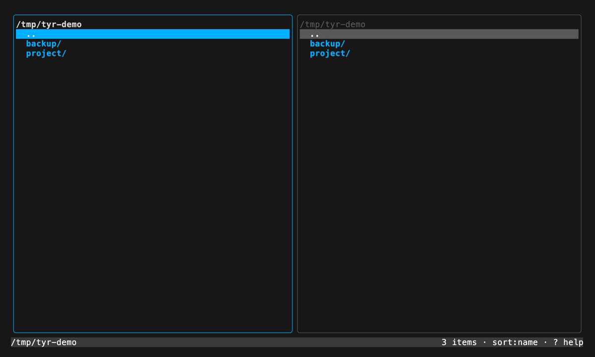

# tyr

> A TUI file manager to rule them all — dual-pane, keyboard-driven, as intuitive as lazygit.

[](https://github.com/kiruva/tyr/actions/workflows/ci.yml)
[](https://goreportcard.com/report/github.com/kiruva/tyr)
[](LICENSE)

Built for the Linux community first, comfortable on macOS. Leans on what Total Commander is
to Windows, reimagined for the terminal.



## What it does

- **Dual panes.** The active pane is the source, the other one is the destination — `Tab` is
  the whole mental model.
- **File operations.** Create, copy, move, and delete, all recursive, each confirmed first and
  run off the UI thread with a live progress bar.
- **Archives.** Pack and unpack `tar`/`zip`/`7z`/`rar`, browse an archive as though it were a
  directory, and add files to one without unpacking it.
- **Text viewer and editor.** Read or edit a file in place — including a file **inside** an
  archive.
- **ssh.** Browse a remote host in either pane and transfer in either direction, with
  `~/.ssh/config` aliases, agent and key authentication, and host-key verification.
- **Themes.** Eight built-in colour schemes with a live-preview picker.

> **Status:** pre-1.0 and under active development. See [CHANGELOG.md](CHANGELOG.md).

## Install

```sh
# With Go 1.26 or newer installed:
go install github.com/kiruva/tyr@latest

# Or build from source:
git clone https://github.com/kiruva/tyr
cd tyr
make build      # produces ./tyr
```

Pre-built binaries for Linux and macOS (amd64/arm64) are attached to each
[release](https://github.com/kiruva/tyr/releases).

Browsing, copying, and editing need nothing but the binary. Archive actions call the system
tool for the format you touch (`tar`, `unzip`, `7z`, `unrar`), and ssh transfers need `tar`
and a POSIX shell on the far side.

## Run it

```sh
tyr                  # or: go run .
tyr --theme nord     # start with a theme
tyr --themes         # list the built-in themes
tyr --version
```

## Keys

| Key                 | Action                          |
| ------------------- | ------------------------------- |
| `j` / `↓`           | Move cursor down                |
| `k` / `↑`           | Move cursor up                  |
| `Ctrl+D` / `Ctrl+U` | Page down / up                  |
| `PgDn` / `PgUp`     | Page down / up                  |
| `g` / `Home`        | Jump to top                     |
| `G` / `End`         | Jump to bottom                  |
| `Enter` / `l` / `→` | Open directory or archive       |
| `h` / `←` / `⌫`     | Go to parent dir                |
| `Ctrl+L` / `:`      | Edit address bar (jump to path) |
| `Tab`               | Switch active pane              |
| `Space`             | Select / deselect entry         |
| `s`                 | Cycle sort (name → size → time) |
| `.`                 | Toggle hidden files             |
| `n`                 | New file in active pane         |
| `N` / `F7`          | New folder in active pane       |
| `F5` / `c`          | Copy selection → other pane     |
| `F6` / `m`          | Move selection → other pane     |
| `F8` / `Del` / `d`  | Delete selection                |
| `p`                 | Pack selection → other pane     |
| `u`                 | Unpack archive → other pane     |
| `U`                 | Unpack archive in place         |
| `v`                 | View file (read-only)           |
| `e`                 | Edit file (nano-style)          |
| `S` / `Ctrl+S`      | ssh connections                 |
| `t`                 | Theme picker                    |
| `?`                 | Show all keybindings            |
| `y` / `n`           | Confirm / cancel a prompt       |
| `q` / `Ctrl+C`      | Quit                            |

Press `?` any time for the full keybinding overlay, grouped by what each key does. Directories
always sort before files; `s` orders the entries within each group.

## Address bar

Each pane's top line is its address bar. It follows the cursor as you walk the tree, and
`Ctrl+L` (or `:`) turns it into an input for jumping straight to a path — `Enter` goes,
`Esc` cancels, `Tab` completes, `↑`/`↓` cycle completions. Paths may be absolute, relative
to the current directory, `~`-rooted, or contain `$VARS`. Typing the path of a browsable
archive opens it as a virtual tree, and an `ssh://` or `host:/path` target starts the ssh
connection flow for that pane (see [Over ssh](#over-ssh)); anything that isn't a directory
leaves the bar open with the reason in the status line.

## Creating

`n` names a new file and `N` (or `F7`) a new folder, in the active pane's current directory —
local or remote. The name may contain separators, so `src/main.go` creates the missing
directories on the way. Absolute paths are refused (use the address bar to move there), and so
is a name that already exists: creating never overwrites.

## Operations

Copy (`F5`/`c`), move (`F6`/`m`), and delete (`F8`/`Del`/`d`) act on the entries marked with
`Space`, or on the highlighted entry when nothing is marked. Copy, move, pack, and unpack all
go from the **active** pane to the **other** pane, so direction is whatever `Tab` says it is.

Every operation is recursive, asks for confirmation first — warning when it would overwrite
something — and runs off the UI thread, streaming progress into a bar while the interface stays
responsive. Both panes refresh when it finishes. **Delete is permanent**: no trash, no undo.

## Archives

`p` packs the selection into a `.tar.gz` in the other pane, `u` unpacks an archive into the
other pane, and `U` unpacks it in place. Archive actions shell out to standard CLIs, and only
the tool for the format you touch is required:

| Format                                                      | Extract | Create              |
| ----------------------------------------------------------- | ------- | ------------------- |
| `.tar`, `.tar.gz`/`.tgz`, `.tar.bz2`, `.tar.xz`, `.tar.zst` | `tar`   | `tar` (pack target) |
| `.zip`                                                      | `unzip` | —                   |
| `.7z`                                                       | `7z`    | —                   |
| `.rar`                                                      | `unrar` | —                   |

Extract progress counts entries with `tar -t` / `zipinfo`; `7z` and `unrar` show an
indeterminate bar.

Press `Enter` on any tar or `.zip` to browse it as a virtual directory tree — `Enter` and `h`
walk it, `v`/`e` open members (see below). `.7z` and `.rar` have to be unpacked to disk first.

With one pane inside an archive and the other on real files, `F5`/`c` or `F6`/`m` **adds** the
selection to the archive at its current virtual directory. `p`/`u` still need a real
destination pane.

## View & edit

`v` opens a file in a scrollable read-only viewer (`e` switches to editing, `q`/`Esc` closes);
`e` opens it in a nano-style editor — `Ctrl+S` saves, `Ctrl+Q` quits, and `Esc` guards unsaved
changes. Binary files are refused.

Both work on archive members. An edited member is written back to the archive: a targeted
update for zip and uncompressed tar, a transparent repack for compressed tar.

View and edit are local-only; copy a remote file across first.

## Over ssh

Press `S` for the connection modal. It lists your saved connections, most recently
used first, with a `●` next to any that are already connected:

```
╭──────────────────────────────────────────────────────────╮
│   Connect over ssh                           left pane   │
│                                                          │
│   ▸ prod         deploy@web01.example.com /srv/www       │
│     backup       ● kim@nas:2222                          │
│     + new connection…                                    │
│                                                          │
│   enter connect · n new · e edit · d delete · esc        │
╰──────────────────────────────────────────────────────────╯
```

`enter` connects, `n` adds one, `e` edits, `d` deletes. The connection opens in the
pane you pressed `S` from — the modal says which one.

A connection records a name, host, user, port, starting path, and optionally a key
file. **It never records a password.** If the host needs one, tyr asks each
time it starts:

```
╭──────────────────────────────────────────────────────────╮
│   Password                                   left pane   │
│                                                          │
│   for prod (deploy@web01.example.com)                    │
│                                                          │
│   ••••••••••                                             │
│                                                          │
│   not saved — asked again next time tyr starts           │
╰──────────────────────────────────────────────────────────╯
```

The password is offered to the server and kept in memory for that session, so
transfers and reconnects after an idle timeout do not ask again. Quitting drops it.
Authentication is tried in order: ssh-agent, then key files, then the password —
so a key-based host never prompts at all.

A host that isn't in `~/.ssh/known_hosts` shows its fingerprint for you to check
before anything is sent to it; accepting appends it to `known_hosts`, as `ssh`
would. A known host presenting a _different key of the same type_ is refused
outright rather than offered as a yes/no — that is either a rebuilt server or an
interception, and either way it wants looking at by hand. A key of an algorithm
you have no entry for is just a key you have not seen, and prompts normally.

As `ssh` does, tyr asks the server for a host key algorithm it already has
recorded, so a host whose `known_hosts` line is ed25519 is not re-verified against
whatever key type the server happens to prefer.

Saved connections live in the same config file as everything else:

```ini
# tyr configuration
# ssh passwords are never stored here
conn.prod.host = web01.example.com
conn.prod.user = deploy
conn.prod.path = /srv/www
```

### Transferring

With one pane remote and one local, `c`/`F5` and `m`/`F6` transfer in whichever
direction the panes describe — the **active** pane is always the source, so copying
down and copying up are the same two keys. `d`/`F8` deletes on the host. With both
panes on the same host, copy and move run there without the data crossing the wire.

The address bar (`Ctrl+L`) also accepts a remote target, which goes through the same
connect flow:

```
ssh://user@host:2222/var/log
user@host:/var/log            # scp-style
host:                         # the login directory
```

While a pane is remote, plain paths in the address bar stay on that host; `local:/path`
(or `file:///path`) brings it back to this machine. `Enter`/`h` walk the tree, `Space`
marks, `s` sorts, `.` toggles hidden files, and `n`/`N` create on the host.

Not available over ssh: pack/unpack, browsing into archives, and view/edit — copy the
file across first. Copying directly between two different hosts is refused; route it
through this machine.

### How it works

tyr speaks ssh in-process (`golang.org/x/crypto/ssh`) rather than shelling out
to the `ssh` binary. That is what makes the password prompt possible at all: `ssh`
reads passwords straight from the terminal, which the TUI owns, and a password passed
any other way would have to travel through a command line or an environment variable
where other processes can see it. In-process, it goes from the input straight into the
authentication exchange.

The trade-off is that a native client does not read `~/.ssh/config` for you, so
tyr parses the part that decides where a connection goes: `HostName`, `User`,
`Port`, `IdentityFile`, `ProxyJump`, plus `Include` and `Host` pattern matching. An
alias that depends on anything else — `ProxyCommand`, for instance — will not resolve
the way `ssh` would. A jump host must accept key or agent authentication, since the
modal only prompts for one password.

Transfers stream a tar archive over one ssh session (`tar -cf -` on one end, `tar -xf -`
on the other) rather than using scp or sftp. Every path is quoted by tyr and
interpreted by exactly one shell, and the local `tar -v` names each file as it moves,
which is what fills the progress bar. The far side needs `tar` and a POSIX shell;
nothing is installed.

## Themes

Eight built-in themes: `default`, `nord`, `dracula`, `gruvbox`, `catppuccin`, `tokyonight`,
`solarized`, `monokai`. Press `t` for the picker — moving the cursor previews the theme live,
`Enter` applies and remembers it, `Esc` puts the old one back.

Resolution order is `--theme` → `$TYR_THEME` → config file → `default`:

```sh
tyr --theme gruvbox
TYR_THEME=dracula tyr
```

The picker writes the choice to `$XDG_CONFIG_HOME/tyr/config` (or
`~/.config/tyr/config`), a plain `key = value` file you can also edit by hand:

```ini
# tyr configuration
theme = nord
```

Saved ssh connections share this file; see [Over ssh](#over-ssh).

> **Upgrading from lazyfiles?** The first run moves a leftover `~/.config/lazyfiles`
> directory to `~/.config/tyr` and tells you it did, so your theme and connections carry
> over. If a `~/.config/tyr` already exists it is left alone and nothing is moved. The
> `LAZYFILES_THEME` environment variable is *not* carried over — use `TYR_THEME`.

Themes are pure data — a name plus eight colours in `internal/ui/theme.go`. Adding one is a
single struct literal; every style is rebuilt from it.

## Development

```sh
make run     # go run .
make test    # go test ./...
make vet     # go vet ./...
make lint    # golangci-lint run
make build   # build ./tyr
```

See [CONTRIBUTING.md](CONTRIBUTING.md) for the project layout and guidelines.

To regenerate the demo GIF, install [VHS](https://github.com/charmbracelet/vhs) and run
`vhs demo.tape`.

## Built with

[Bubble Tea](https://github.com/charmbracelet/bubbletea) ·
[Lip Gloss](https://github.com/charmbracelet/lipgloss) ·
[Bubbles](https://github.com/charmbracelet/bubbles)

## License

[MIT](LICENSE)
